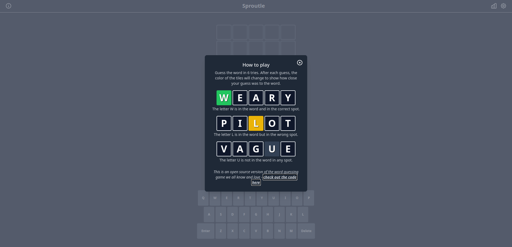
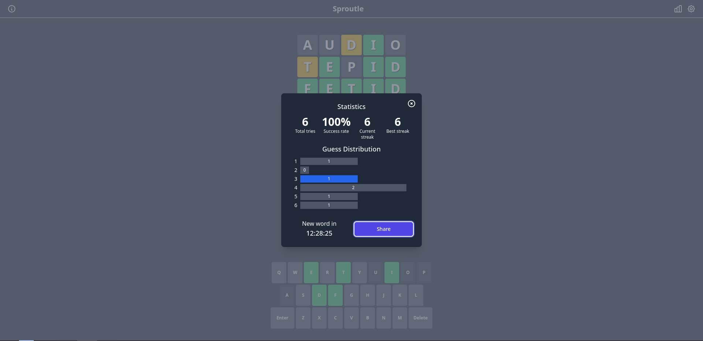

# 2022 資訊之芽 C/C++ 班大作業一：Sproutle

## 目錄
1. [作業介紹](#introduction)
2. [環境與程式](#environment-and-code)
    * [環境](#environment)
    * [程式碼](#code)
3. [程式架構與作業說明](#spec)
    * [Dictionary](#dictionary)
    * [UserDB](#userdb)
    * [Server](#server)
4. [執行程式、評分與繳交](#how-to-run)
    * [執行程式](#execution)
    * [評分](#scoring)
    * [繳交](#submission)
5. [成品](#product)

## 作業介紹 

最近一款名為 [Wordle](https://www.nytimes.com/games/wordle/index.html) 的小遊戲非常熱門，而這個遊戲的程式邏輯也相當簡易。這個大作業內容就是實作一個規則與 Wordle 相同的小遊戲，讓同學體驗一下學習程式除了解題之外，這樣一個熱門的小遊戲也是你可以寫出來的。

Wordle 的規則相信同學都已經清楚，不熟悉的同學可以點上面的連結去玩玩看 Wordle，對於理解這個作業會很有幫助。

作業網址：https://github.com/cdes5804/Sproutle

## 環境與程式 

### 環境 
在開始這次作業之前，同學需要先把開發的環境建設起來。這次會用到的工具是 [Docker](https://www.docker.com/products/docker-desktop/)，請同學先點選左邊的連結按照自己的作業系統（Windows 或 MacOS）安裝對應版本的 Docker Desktop。

使用 Linux 的同學請參考[官方安裝文件](https://docs.docker.com/engine/install/)來安裝 Docker 以及參考[這個文件](https://docs.docker.com/compose/cli-command/#install-on-linux)來安裝 Docker Compose V2。*既然選擇使用 Linux 了，安裝這些應該難不倒你吧 :P*

使用 Windows 的同學還需要另外安裝 Git。請到[這裡](https://git-scm.com/download/win)下載 Installer 然後照著指示安裝即可。

### 程式碼 
接著我們來下載這次作業的 Starter Code。使用 Windows 的同學請打開 PowerShell，使用 MacOS 的同學請打開 Terminal，使用 Linux 的同學請打開你的 terminal/shell。為了方便與統一，講師**建議把 code 下載到桌面**，以下也都會以桌面為例。

打開上面提到的 powershell/terminal 之後，請輸入
1. `cd Desktop` (跳轉到桌面)
2. `git clone https://github.com/cdes5804/Sproutle.git` （下載 code）

現在在桌面應該可以看到 Sproutle 的 code 了。

## 程式架構與作業說明 

Sproutle 主要有3個組成：Dictionary, UserDB, Server。這3個部份的架構以及功能講師已經設計好了，同學需要做的事情是把缺少的程式碼寫上去讓他們可以正常運作。

每個部份都有「標頭檔」與「程式檔」，其中「標頭檔」定義了一些變數和function 的格式（signature）；「程式檔」則是要實際寫出「標頭檔」裡定義的 function 的邏輯，也是同學需要寫程式的地方。

「標頭檔」裡面講師有幫每個 function 寫上功能的註解，如果同學不確定怎麼實作可以去對應的標頭檔看說明。標頭檔的內容大部份不需要更改，但有需求的話也可以自行調整。但是**禁止更改**以下需要實作的 function 的格式（signature）。

建議同學按照以下的順序去實作這3個部份。

### Dictionary 
程式檔：`src/dictionary/dictionary.cc`

標頭檔：`src/include/dictionary/dictionary.hh`

變數：
* `answer_pool_`：一個字串的陣列，裡面裝著 sproutle 可以選擇拿來當答案的單字。這部份講師已經幫同學處理好，裡面已經裝著許多字串可以直接使用。每個字串長度固定是5。
* `answer_pool_size_`：代表 `answer_pool_` 裡面有幾個字串。講師已經幫同學處理好可以直接使用，但請小心不要更改到他的值。
* `allowed_guesses_`：一個字串陣列，裡面裝著玩家可以猜的單字。這些單字跟 `answer_pool_` 裡的單字不會重複，因此這裡面的單字不可能是答案。玩家猜的單字必須是 `answer_pool_` 或是 `allowed_guesses_` 裡的其中一個。這部份講師已經幫同學處理好，裡面已經裝著許多字串可以直接使用。每個字串長度固定是5。
* `allowed_guesses_size_`：代表 `allowed_guesses_` 裡面有幾個字串。講師已經幫同學處理好可以直接使用，但請小心不要更改到他的值。
* `maximum_common_characters_allowed_`：在下面 `GetNewWord()` 說明。講師已經設定好這個變數的值，同學不需要（也禁止）去更改。
* `last_returned_word_`：一個字串，用途在下面 `GetNewWord()` 說明，同學可以自由改變這個字串的內容。

負責跟單字有關的邏輯，同學必須完成以下的 function 來讓 dictionary 可以運作：

* `void GetNewWord(char word[])`

  有玩家想要加入遊戲，dictionary 必須從 `answer_pool_` 裡面找一個單字設定成要讓這個玩家猜的答案。但是這個單字必須符合以下條件：
  1. 這次回傳的單字跟上次的單字不能超過 `maximum_common_characters_allowed_` 個相同的字元，但是如果 `answer_pool_` 裡面的字串沒辦法符合這個條件則可以無視這個條件。
  2. 這次回傳的單字不能跟上次相同，但是如果 `answer_pool_` 裡面的字串沒辦法符合這個條件則可以無視這個條件。
  
  講師有提供同學 `GetCommonCharacterCount()` 的 function 可以回傳兩個字串有幾個相同的字元，同學可以視情況字型使用這個功能。

  選擇好單字後，把單字放在 `word` 這個字串裡面即可。

* `bool IsWordInDictionary(const char word[]) const`

  檢查 `word` 是否有在字典裡面，只要有出現在 `answer_pool_` 或是 `allowed_guesses_` 都算是。都沒有則否。

### UserDB 
程式檔：`src/user_db/user_db.cc`

標頭檔：`src/include/user_db/user_db.hh`

變數：
* `users_`：型態為 `UserInfo` 的陣列，用來儲存使用者的資訊。關於 `UserInfo` 的內容可以參考標頭檔內的定義。

負責紀錄每位使用者的狀態。包含每位使用者要猜的答案、已經猜了幾次等等。必須完成以下的 function 讓 UserDB 可以運作：

* `UserId CreateNewUser(const char answer_for_user[])`

  創建一個新的使用者，給予他一個**獨特**的 UserId，並且把這個使用者要猜的答案設為 `answer_for_user`。

  UserId 的型態是 unsigned int，可以儲存 0~4294967295 之間的整數。每個使用者的 UserId 必須不一樣因為我們需要透過 UserId 來辨認使用者。為了確保每一位使用者的 UserId 都不相同，你可能會需要修改標頭檔給 `UserDB` 加入一些變數用來紀錄 UserId 的狀態。

  為了不讓難度太高，同學可以預設**不會有超過1000位使用者**。

* `void GetUserAnswer(UserId user_id, char answer_for_user[])`
  尋找 UserId 是 `user_id` 的使用者，並回傳這位使用者應該要猜的答案。回傳的方式是把這個字串放進 `answer_for_user` 裡。

  如果沒有找到對應的使用者，**請把 `answer_for_user` 設成空字串**。（想想看怎麼讓一個字串變成空的）

* `int32_t GetUserGuessCount(UserId user_id)`

  尋找 UserId 是 `user_id` 的使用者，並回傳這個使用者已經猜過幾次。

  如果沒有找到對應的使用者，**請回傳 -1**。

* `void SetUserGuessCount(UserId user_id, int32_t guess_count)`

  把 UserId 是 `user_id` 的使用者猜過幾次的數量設為 `guess_count`。

  如果沒有找到對應的使用者，**直接 return 即可**。

* `bool RemoveUserFromDB(UserId user_id)`

  把 UserId 是 `user_id` 的使用者刪除。並且回傳刪除是否成功（除非找不到這個使用者否則都應該要成功）。

  刪除使用者有很多方式，同學只需要確保刪除後沒辦法再找到這個使用者即可。

### Server 

程式檔：`src/server/server.cc`

標頭檔：`src/include/server/server.hh`

變數：
* `dictionary_`：一個 Dictionary。
* `user_db_`：一個 UserDB。
* `guess_limit_`：每位使用者最多可以猜幾次。在這次作業裡面固定設為 6，同學不需更改。

負責處理使用者的各種操作，包含新的使用者加入以及使用者要猜答案的過程。Server 會需要用到 Dictionary 以及 UserDB 的功能來運作，所以上面兩項是否有正確實作會影響到 Server 的運作。

當 Server 想要使用 Dictionary 與 UserDB 的功能時，可以使用 `->` 來操作。例如想要呼叫 Dictionary 的 `GetNewWord()` 時，語法是 `dictionary_->GetNewWord()`。

Server 本身需要提供兩個 function：

* `UserId Connect()`

  當新的使用者想要加入時會自動觸發這個 function。你需要為這個使用者建立資料並且選擇一個單字讓他猜，最後回傳這個使用者的 UserId。

* `void Guess(const GuessArgs& args, GuessReply* reply)`

  當一個使用者想要猜答案時會自動觸發這個 function。當這個 function 被呼叫時，會傳入兩個變數，分別是 `args` 以及 `reply`，關於這兩個變數的內容可以參考 `src/include/server/message.hh` 內的定義。

  `args` 裡面會存呼叫這個 function 的 UserId，以及他猜的單字；`reply` 則是一個指標，同學必須處理 `args` 的內容然後將適當的回覆（例如有沒有猜對）填進 `reply` 裡。

  當這個 function 被呼叫時，同學應該按照以下的邏輯進行處理：

  1. 檢查 UserId 是否有對應的使用者，如果沒有找到使用者就把 `reply` 裡的 `reply_status_` 設為 `ReplyStatus::INVALID_USER` 並直接回傳。
  2. 檢查這個使用者猜的字是否在字典裡，如果不在字典裡就把 `reply` 裡的 `reply_status_` 設為 `ReplyStatus::WORD_NOT_FOUND` 並直接回傳。
  3. 檢查使用者這次猜的字跟設定給他猜的答案是否相同，把結果寫進 `reply` 裡的 `guess_results_`。可以使用的值有：
      * `GuessResult::CORRECT`：這個字元猜對了
      * `GuessResult::PRESENT`：這個字元猜錯了但是正確答案裡有這個字元。
      * `GuessResult::ABSENT`：這個字元猜錯了且正確答案不包含這個字元。
  4. 如果使用者答對了，把 `reply_status_` 設為 `ReplyStatus::WON`；如果使用者已經猜超過 `guess_limit_` 次，把 `reply_status_` 設為 `ReplyStatus::LOST`。其餘情況把 `reply_status_` 設為 `ReplyStatus::OK`。
  5. 把已經贏或輸的使用者移除。

  還有一些細節留給同學自己思考，這裡會大量使用到 Dictionary 與 UserDB 的功能，所以要先確保這兩個有正確實作。同時也要注意如果答案或是使用者猜的字有重複的字元，狀態應該如何設定？這部份我們會採用跟 Wordle 一樣的標準來測試。

## 執行程式、評分與繳交 

### 執行程式 
請同學執行 Docker Desktop 後打開 powershell/Terminal 執行以下指令來建立開發環境：

#### PowerShell (Windows):
1. `cd Desktop\Sproutle`
2. `docker build -t sproutle .`
3. `docker create -t -i --name sproutle -v ${PWD}:/sproutle sproutle bash`

#### Terminal (MacOS):
1. `cd Desktop/Sproutle`
2. `docker build -t sproutle .`
3. `docker create -t -i --name sproutle -v $(pwd):/sproutle sproutle bash`

#### Linux
1. `cd Desktop/Sproutle`
2. `sudo docker build -t sproutle .`
3. `sudo docker create -t -i --name sproutle -v $(pwd):/sproutle sproutle bash`

完成上面指令後，執行 `docker start -a -i sproutle` 就可以進入開發環境了。

上面的指令只需要在第一次執行，之後想要寫程式的時候，可以啟動 Docker Desktop 後打開 PowerShell/Terminal 後執行 `docker start -a -i sproutle` 就好。

進入開發環境後，請執行以下指令：
1. `cd /sproutle`
2. `git submodule update --init`
3. `mkdir -p build`
4. `cd build`
5. `cmake ..`

**說明**: 所謂開發環境是讓同學執行程式的地方，寫程式的時候同學用自己熟悉的工具來邊寫在桌面上的 Sproutle 資料夾內的檔案就好。當你覺得寫到一個段落想要執行程式或是測試時才需要進到開發環境。

進到開發環境並執行了上面 5 個指令後，你可以輸入以下幾種指令：
* `make check-tests`：編譯你的程式並執行講師寫好的測試來檢查程式是否正確。
* `make format`：會自動把你的 code 格式變好看，請善加利用。
* `make check-coding-style`：檢查目前的 coding style 是否有問題，詳細會在後面提到。

### 評分 

這次作業的評分來自於同學實作 Dictionary, UserDB, Server 的正確性。
講師有提供一些**公開**的測試給同學，分別是
* `test/dictionary/dictionary_test.cc`
  * Test New Word Satisfies Rule 1
  * Test New Word Satisfies Rule 2
  * Test Only One Valid Word
  * Test Valid And Invaid Word
* `test/user_db/user_db_test.cc`
  * Test Create User
  * Test Get User Answer
  * Test Set/Get User Guess Count
  * Test Remove User
* `test/server/server_test.cc`
  * Test Connect
  * Test Invalid User
  * Test Guess Invalid Word
  * Test Guess Limit

上面總共 12 個測試每個各佔 5%，因此公開的測試佔總分的 60%。最後評分時還有隱藏測試佔總分的 40%。

同學想要測試時只要進入開發環境，按照上面的指示執行 `make check-tests` 就會自動執行這些公開的測試。

除了正確性的評分之外，為了鼓勵同學養成良好的 coding style，這次作業會將 coding style 列入評分。當同學通過公開測試之後還要執行 `make check-coding-style` 來執行 coding style 的測試。如果有跳出任何 warning 或是 error 都視為不通過（會有訊息告訴你哪裡有問題還有應該怎麼修），**最終成績打 9 折**。

雖然 coding style 沒有標準答案，每個人有不同習慣，但為了評分的標準這次講師設定了一個希望大家遵守的 style，例如 function 名稱使用 big camel case、變數用底線等等。偶爾執行 `make format` 來自動美化程式碼也可以避免一些 coding style 會被檢查出問題的情況。

### 繳交 
請同學建立一個名為 `Sproutle` 的資料夾後把以下檔案複製過去：
* `src/dictionary/dictionary.cc`
* `src/include/dictionary/dictionary.hh`
* `src/user_db/user_db.cc`
* `src/include/user_db/user_db.hh`
* `src/server/server.cc`
* `src/include/server/server.hh`

之後將這個資料夾**壓縮為 zip 檔**後上傳到 https://forms.gle/DJTn7yJ4cM7TuKNZ7 。如果打包內容或格式不合者，**最終成績打 9 折**。

## 成品 

如果你覺得你已經完成所有功能並通過所有測試，可以打開 PowerShell/Terminal，執行
* `cd Desktop/Sproutle`（切換到 Sproutle 資料夾）
* `docker compose up` （把遊戲跑起來）

等待他建立整個程式後，打開瀏覽器然後在網址列輸入 `localhost` 就可以實際玩玩看你寫出來的 Sproutle 了！

